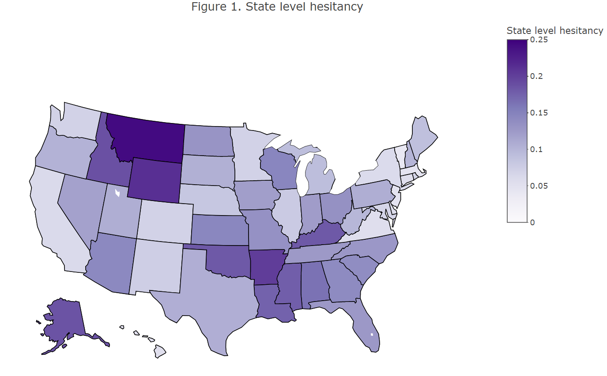

```{r setup, message=FALSE, echo=FALSE, warning=FALSE}
library(webshot)
library(lubridate)
library(tidyverse)
library(tidyr)
library(data.table)
library(plotly)
library(leaflet)
library(readxl)
library(RSocrata) 
library(grid)

# Initialize code chunk options
knitr::opts_chunk$set(
  warning = FALSE,
  message = FALSE,
  eval=TRUE,
  echo = TRUE,
  cache = FALSE)
```

# Introduction

Vaccine hesitancy, which is the reluctance or refusal to vaccinate despite the availability of vaccines,  has been proposed by the World Health Organization (WHO) as one of the ten threats to global health in 2019 https://www.who.int/news-room/spotlight/ten-threats-to-global-health-in-2019, even before the global pandemic of COVID-19.

Vaccine is currently one of the most cost-effective ways of preventing disease outbreak and reducing disease consequence, and consequently disease's impact on economic. As of 2019, 2-3 million deaths a year are prevented by vaccination. If global coverage of vaccinations is improved , an estimated 1.5 million of death could be further avoided.

As for the reason of vaccines hesitancy are complex, could be a result of numerous factors including lack of education, knowledge of how vacines are produce, distrust of government or authorities, or even just fear of needles. Its existence dates back the time vaccines were invented, however, it is only recently that it started to resurface to the discussion of mainstream media. 

After the global outbreak of COVID-19 and the invention of COVID-19 vaccines, vaccine hesitancy plays an even more important role than before.  We can observe vaccines being not just a measure of disease prevention, but also a mean of politics, yet we can also see a subset of population refused to get vaccinated even with the resources at hand.

This report is not to discuss the cause of vaccine hesitancy or the legitimacy of the claims by certain "anti-vaccinationism", but to see if vaccine hesitancy actually impacts the death and case number of COVID-19 on a state level in the US.  

\newpage

# Methods

## Datasets

A total of 3 datasets will be used in this project. The first two are from US Center for Disease Control and Prevention, and the third one are from United States Census Bureau (an official website of the United State Government).

1. The fisrt dataset is “Vaccine Hesitancy for COVID-19: County and local estimates” from https://data.cdc.gov/Vaccinations/Vaccine-Hesitancy-for-COVID-19-County-and-local-es/q9mh-h2tw

```{r, cache=TRUE, message=FALSE, echo=FALSE, warning=FALSE}
ori_hes <- read.socrata(
  "https://data.cdc.gov/resource/q9mh-h2tw.json",
  app_token = "trg1fGPbmeJk0ZrQSlXmQMTBV",
  email     = "tzuyuhua@usc.edu",
  password  = "CodingCary0130"
)

hes <- as.data.table(ori_hes)
```


```{r, message=FALSE, echo=FALSE, warning=FALSE}
hes$state_boundary.coordinates <- NULL
hes$county_boundary.coordinates <- NULL
```

2. The second dataset is "United States COVID-19 Cases and Deaths by State over Time" from https://data.cdc.gov/Case-Surveillance/United-States-COVID-19-Cases-and-Deaths-by-State-o/9mfq-cb36

```{r echo=FALSE, message=FALSE, warning=FALSE, cache=TRUE}
death <- read.socrata(
  "https://data.cdc.gov/resource/9mfq-cb36.json",
  app_token = "Sc1lehIxeCtFlCTmvmYgobCJD",
  email     = "tzuyuhua@usc.edu",
  password  = "CodingCary0130"
)

death <- as.data.table(death)

```


3. And for the comparison between states summary statistics to be reasonable and effective, I need the population data of different places. "County Population Totals: 2020-2021" from https://www.census.gov/data/tables/time-series/demo/popest/2020s-counties-total.html


```{r , message=FALSE, echo=FALSE, warning=FALSE}
county_pop <- read_excel("co-est2021-pop.xlsx", range = "A6:D3149", col_names = FALSE)
colnames(county_pop) <- c("county_name", "April2020", "Jul2020", "July2021")

Variable <-c("county_name", "April2020", "Jul2020", "July2021")

Description <- c("Geographic Area", "April 1, 2020 Estimates Base", "2020 Population Estimate (as of July 1)", "2021 Population Estimate (as of July 1)")
```

## Estimated state vaccine hesitancy level

The state vaccine hesitancy level is estimated by calculating the weighted average of the county hesitancy level, with population information from the third dataset as weight. While the state population us calculated by summing the counties population within each state.   

```{r , cache=TRUE, message=FALSE, echo=FALSE, warning=FALSE}
hes$estimated_hesitant <- as.numeric(hes$estimated_hesitant)
hes$estimated_hesitant_or_unsure <- as.numeric(hes$estimated_hesitant_or_unsure)
hes$estimated_strongly_hesitant <- as.numeric(hes$estimated_strongly_hesitant)
hes$social_vulnerability_index <- as.numeric(hes$social_vulnerability_index)

death$tot_cases <- as.numeric(death$tot_cases)
death$tot_death <- as.numeric(death$tot_death)
county_pop$county_name <- gsub("\\.","", county_pop$county_name)
county_pop$county_name <- gsub("\\,","", county_pop$county_name)
hes$county_name <- gsub("\\,","", hes$county_name)
hes$county_name <- gsub("\\.","", hes$county_name)
county_pop <- as.data.table(county_pop)

hes <- 
  merge(
  # Data
  x     = hes,      
  y     = county_pop[, .(county_name, July2021)], 
  # List of variables to match
  by.x  = "county_name",
  by.y  = "county_name", 
  # Which obs to keep?
  all.x = TRUE,      
  all.y = FALSE
  )

hes[, social_vulnerability_index := fcoalesce(social_vulnerability_index, mean(social_vulnerability_index, na.rm = TRUE)),
    by = .(state)]

hes[ , state_pop  := sum(July2021), by = .(state_code)]
hes[ , state_hes      := sum(estimated_hesitant*July2021)/state_pop , by = .(state_code)]
hes[ , state_hes_uns  := sum(estimated_hesitant_or_unsure*July2021)/state_pop, by = .(state_code)]
hes[ , state_stro_hes := sum(estimated_strongly_hesitant*July2021)/state_pop, by = .(state_code)]
hes[ , SVI := sum(social_vulnerability_index*July2021)/state_pop, by = .(state_code)]

hes <- hes[, state_SVI_cat := fifelse( SVI <= 0.19, "Very Low", 
                        fifelse( SVI <= 0.39, "Low",
                        fifelse( SVI <= 0.59, "Moderate",
                        fifelse( SVI <= 0.79, "High",
                       "Very High"))))
 ]

merge <- 
  merge(
  # Data
  x     = death,      
  y     = unique(hes[, .(state, state_code, state_hes, state_hes_uns, state_stro_hes, SVI, state_SVI_cat, state_pop)]), 
  # List of variables to match
  by.x  = "state",
  by.y  = "state_code", 
  # Which obs to keep?
  all.x = TRUE,      
  all.y = FALSE
  )

merge <- as.data.table(merge)

merge[ , max.date      := max(submission_date), by = .(state)]
date_mer <- merge[merge$max.date == merge$submission_date, ]

state_mer <-  date_mer[ date_mer$state %in% hes$state_code]
```

\newpage

# Results

First, we look at the distribution of estimated hesitancy level for each state. It seems that Montana, Wyoming, Alaska, Arkansas are the few states with the higher estimated state vaccine hesitancy level among all the states within the US (Figure 1). An interactive version of this plot can be found on my website. https://rawcdn.githack.com/tzuyuhua/PM566-finalproject/bc7d92e2def05c61b190ebbe0656976028f4a998/index.html 

```{r, message=FALSE,  out.width = "450px", echo=FALSE, warning=FALSE}

```

Next, we look at the Population-normalized COVID-19 deaths/cases over time (Figure 2). We are trying to see if states with higher estimated state vaccine hesitancy level would also show a stronger surge of COVID-19 cases and deaths per person (state level case number and death number divided by state population) over time. We can observe that for both Alaska and Arkansas, two state that were previously observed with higher estimated state vaccine hesitancy level among all the states within the US, shows a strong surge of cases and deaths compare to other state. However, this trend does not hold for Montana, while it only shows an average level of surge of COVID-19 cases and deaths compare to other states. An interactive version of this plot can be found on my website. https://rawcdn.githack.com/tzuyuhua/PM566-finalproject/bc7d92e2def05c61b190ebbe0656976028f4a998/index.html 


```{r echo=FALSE, fig.width = 7, fig.height= 10, message=FALSE, warning=FALSE}
state_mer$tot_cases <- as.numeric(state_mer$tot_cases)
state_mer$tot_death <- as.numeric(state_mer$tot_death)

merge = merge[order(merge$state, merge$submission_date),]

qplot(submission_date, tot_cases/state_pop, data = merge,
       color = state, 
       geom = c("line"), main = "Figure 2a. Population-normalized COVID-19 cases over time", ylab = list(title = "Cases per person"), xlab = list(title = "Submission date")) +theme(legend.position="bottom")
```


```{r echo=FALSE, fig.width = 7, fig.height= 10, message=FALSE, warning=FALSE}
qplot(submission_date, tot_death/state_pop, data = merge,
       color = state, 
       geom = c("line"), main = "Figure 2b. Population-normalized COVID-19 deaths over time", ylab = list(title = "Deaths per person"), xlab = list(title = "Submission date")) +theme(legend.position="bottom")

```


Third, we examine the relationship between total cases, total deaths, and with the diameter of the data point as the estimated state hesitancy level. We are expecting to see a positive correlation between total cases and total deaths (controlled for state population), which is shown in Figure 4. We are also trying to see if data points closer to the upper right hand corner (more deaths and cases per person), would also be bigger in diameter, showing correlation with vaccine hesitancy level. And that is generelly the case in Figure 4, although Alaska is interesting, with high cases per person and high estimated hesitancy level, but relatively low deaths per person. An interactive version of this plot can be found on my website. https://rawcdn.githack.com/tzuyuhua/PM566-finalproject/bc7d92e2def05c61b190ebbe0656976028f4a998/index.html 

```{r echo=FALSE, message=FALSE, warning=FALSE, fig.width = 10, fig.height= 10}
ggplot(data = state_mer, aes(x = tot_cases/state_pop, y = tot_death/state_pop, size = state_hes ,color = state.y, alpha = 0.5)) + geom_point() + labs(title = "Figure 3.") + xlab("Total cases per person") + ylab("Total deaths per person") + labs(size = "State level hesitancy" ,color = "State") + scale_size(range = c(0.5, 30)) + xlim(0.15, 0.41) + ylim(0.001, 0.0047) +theme(legend.position="bottom") +guides(size = FALSE, alpha= FALSE)
```


```{r, echo=FALSE, message=FALSE, warning=FALSE}
linecase <- state_mer %>%
  ggplot(mapping = aes(x = state_hes, y = tot_cases/state_pop)) +
  geom_point() + 
  geom_smooth(method = lm, se = FALSE, col = "black") + 
  labs(title = "Figure 4a.") + xlab("State level hesitancy") + 
  ylab("Total cases per person")
```

```{r, echo=FALSE, message=FALSE, warning=FALSE}
linedeath <- state_mer %>%
  ggplot(mapping = aes(x = state_hes, y = tot_death/state_pop)) +
  geom_point() + 
  geom_smooth(method = lm, se = FALSE, col = "black") + 
  labs(title = "Figure 4b.") + xlab("State level hesitancy") + 
  ylab("Total deaths per person")
```

```{r, echo=FALSE, message=FALSE, warning=FALSE}
library(gridExtra)
grid.arrange(linecase, linedeath, nrow = 1)
```

Now thats take a look at the relationship between hesitancy and It does appear that there is some positive correlation between vaccine hesitancy and total number of cases (proportion to state population size) (Figure 4a). From the above graph, there is also a positive correlation between vaccine hesitancy and total number of deaths (proportion to state population size). And the slope appears to be even steeper.(Figure 4b)  

# Conclusion
Overall, vaccine hesitancy does show to have a positive correlation with death and cases, and death especially, which is in accordance with the general science community consensus, that vaccine can slow down the rate of COVID-19 transmission, and reduce COVID-19 symptom severity (increase protection against hospitalization and death in people). However, more confounding variables (etc, age, masks or population density) should be included to better understand the relationship. 

